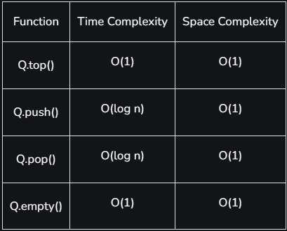

## Priority Queue
A priority queue is a type of queue that arranges elements base on their priority values, elements with higher priority values are typically retrieved before others elements that it's not 

Priority queue is used in many popular algorithms, it's the implementation of **Max Heap** by default and is an extension of the [Queue](./5.1Queue)  with the following properties 

+ Every item has a priority associated with it
+ An element with high priority is dequeued before an element with low priority.
+ If two elements have the same priority, they are served according to their order in the queue.
**Syntax:**
`priority_queue<data_type> NameOfQueue`
or we can implemented **Min Heap** 
`priority_queue<data_type,vector<data_type>,greater<data_type>> Nameofqueue`


### How is Priority assigned to the elements in a Priority Queue?

in a Priority queue usually the value of an element is considered for assigned the priority
for example  the element with the highest value is assigned the highest priority and the element with the lowest is assigned the lowest and the reverse case can also be used

### Operations of a Priority queue

#### 1.Insertion
When a new element is inserted in a priority queue, it moves to the empty slot from top to bottom and left to right. However, if the element is not in the correct place then it will be compared with the parent node. If the element is not in the correct order, the elements are swapped. The swapping process continues until all the elements are placed in the correct position.

#### 2.Deletion 
 In a max heap, the maximum element is the root node. And it will remove the element which has maximum priority first. Thus, you remove the root node from the queue. This removal creates an empty slot, which will be further filled with new insertion. Then, it compares the newly inserted element with all the elements inside the queue to maintain the heap invariant.

#### 2.Peek
This operation helps to return the maximum element from Max Heap or the minimum element from Min Heap without deleting the node from the priority queue.


### Types Of Priority queue 

+ Ascending Order 
	in ascending order priority queue, the element with a lower priority value is given a higher priority in the priority list. Example [4,6,8,9,10] So when we dequeue from this type of priority queue, 4 will remove from the queue and dequeue returns 4. because is the smallest number then is the higher priority
	
+ Descending order Priority Queue
	In Descending order the root node is the maximum element in a Max Heap, Example [4,6,8,9,10] So when we dequeue from this type of priority queue, 10 will remove from the queue and dequeue returns 10. because is the Highest number then is the higher priority

you can personalize your `priority_queue` with structures like this  to push an element with an priority
````cpp
struct Element

{
    int value;
    int priority;
    Element(int val, int prio) : value(val), priority(prio) {}
    bool operator<(const Element &otroElement) const
    {
        return priority < otroElement.priority;
    }

};

priority_queue<Element> prioridad;
````

or you can use other forms like this one 
````cpp
 priority_queue<pair<int,int>, vector<pair<int,int>>, greater<pair<int,int>>> pq;
````
We use  pair to indicate the element we enqueue, and as a second argument a vector<pair<int, int>>  to indicate this container type used to store elements in the queue, Finally greater<pair<int, int>> to indicate that the element save in ascending Order (MinHeap)


### Complexity



