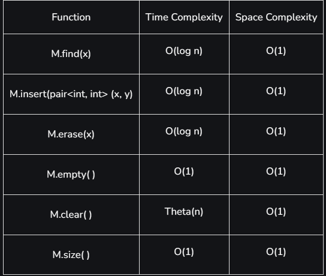

Map is a class of STL that stores the values in the pattern of key-value pair
**Syntax:**
`map<data_type,data_type>nameofmap
**map <int,int>M**
+ stores the values in the pattern of key-value
- we can't have different keys with de same name in the same map
- it is the implementation of self-balancing, usually **Red-Black Trees**, to have the order of the keys
**multimap <int,int> MM**
- it's allow have same keys with different values 
- It's the implementation of **Red-Black Trees** which are self-balancing trees making the cost of operations the same as the map.
**unordered_map<int,int>UM**
- stores the values in the pattern of key-value
- we can't have different keys with de same name in the same map
- it's the implementation of [**Hash Table**](https://www.geeksforgeeks.org/hashing-data-structure/) which makes  the complexity of operations like insert, delete and search to **Theta(1)**.
**unordered_multimap<int,int>UMM**
- It's allow have same keys with different values 
- It's the implemented same as the unordered map is implemented which is the  [**Hash Table**](https://www.geeksforgeeks.org/hashing-data-structure/)

### Principal Methods

+ `begin()`: Returns an iterator to the first element in the map.
- `end()` Returns an iterator to the theoretical element that follows the last element in the map.
- `size()`: Returns the number of elements in the map.
- `max_size()`: Returns the maximum number of elements that the map can hold.
- `empty():` Returns whether the map is empty.
- `pair_insert(key,value)` Adds a new element to the map.
- `clear()`: Removes all the elements from the map.

### Map vs Unordered_map

## Complexity:
