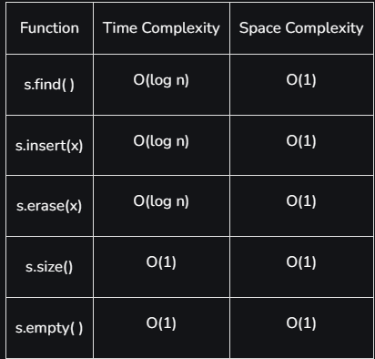

this is an [associative Container](../1.STLContainersTypes) that stores unique elements in ascending order
- It's implementation of Binary Search Trees

**Syntax:**
`set<data_type>NameOfSet`

Like map, set can be 
	»unordered_set
	»multiset
	»unordered_multiset

