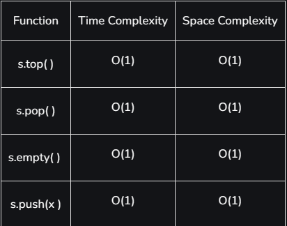

The stack is a container adapter that provide a LIFO(last in, first out)

It is a data structure that follows the **Last In First Out (LIFO)** rule, this class of STL is also  used in many algorithms during their implementations.   
For e.g, many [recursive](https://www.geeksforgeeks.org/recursion/) solutions

**Syntax:**
`stack<data_type> STACK`

