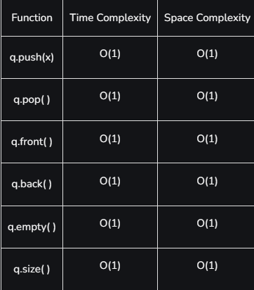

This is another Container Adapter that provides a FIFO (First In, First out)

- Queue in STL is implemented using a linked list.
- Elements are added at the back (enqueue) and removed from the front (dequeue).
- The inclusion of queue STL class queue in code reduces the function calls for basic operations.
#### Common Operations

- `push()` : added at the back (enqueue)
- `pop()` :removed from the front (dequeue)
- `front()`: access the front element
- `back()` :access the back element

