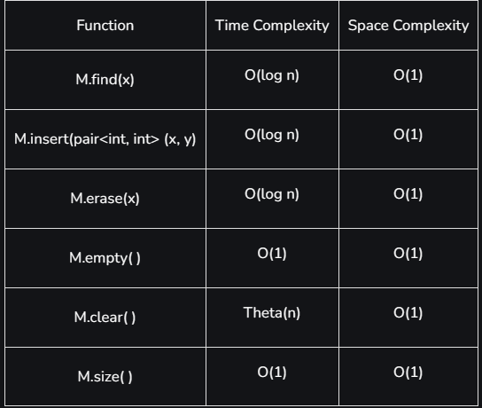

Map is a class of STL that stores the values in the pattern of key-value pair

**Syntax:**
`map<data_type,data_type>nameofmap

### map <int,int>M
+ stores the values in the pattern of key-value
- we can't have different keys with de same name in the same map
- it is the implementation of self-balancing, usually **Red-Black Trees**, to have the order of the keys
### multimap <int,int> MM
- it's allow have same keys with different values 
- It's the implementation of **Red-Black Trees** which are self-balancing trees making the cost of operations the same as the map.
### unordered_map<int,int>UM
- stores the values in the pattern of key-value
- we can't have different keys with de same name in the same map
- it's the implementation of [**Hash Table**](https://www.geeksforgeeks.org/hashing-data-structure/) which makes  the complexity of operations like insert, delete and search to **Theta(1)**.
### unordered_multimap<int,int>UMM
- It's allow have same keys with different values 
- It's the implemented same as the unordered map is implemented which is the  [**Hash Table**](https://www.geeksforgeeks.org/hashing-data-structure/)

## Complexity:
