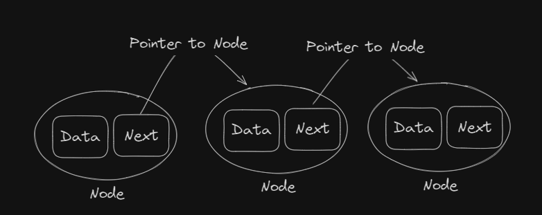
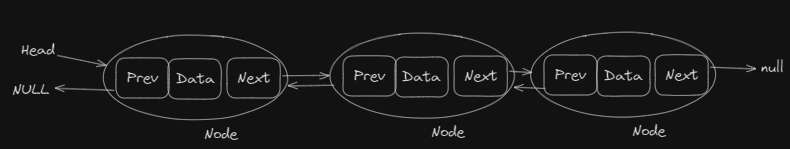

### What is Linked List 
A linked list is a linear data structure in which the element are not stored at contiguos memory location, the element in a linked list are linked using pointers 

### Why need linkedList?

- Dynamic Data Structure: the size of memory can be allocated or de-allocated at run time
- Ease of insertion-deletion: the insertion and deletion are simpler that arrays because just the address needed to be updated
- Efficient Memory utilization: Linked list is a dynamic data structure the size increases or decreases as per the requirement

### Types of Linked List

#### Single Linked list 

#### Double Linked list 

#### Circle linked List

### Disadvantages
- Random Access: unlike arrays, linked list don't allow the element direct with the index, we need search a specific node 
- Extra Memory: Linked list needs additional memory to stored the pointer to next node 

